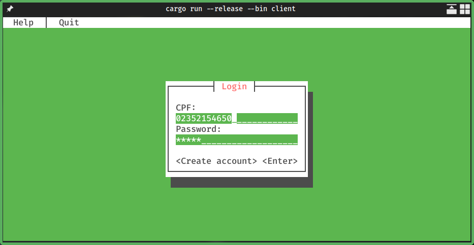
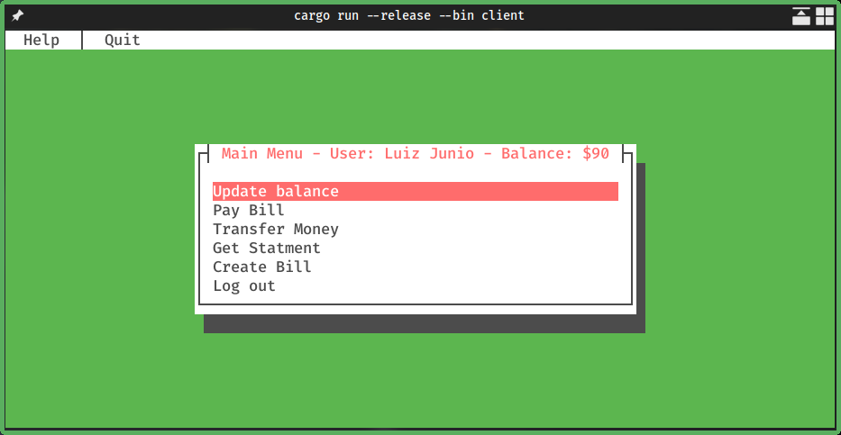

# feobank
Feobank é um projeto de internet banking para o trabalho de laborátorio de redes.

Como esse é um projeto desenvolvido na linguagem Rust, que em portugues se traduz em Ferrugem, o nome
"Feo" vem da fórmula quimica Fe²O³ ([Óxido de Ferro III](https://pt.wikipedia.org/wiki/%C3%93xido_de_ferro(III))). 
Inspirado pela origem do nome do banco digital "C6 bank", onde C6 é o atomo de carbono 6.

